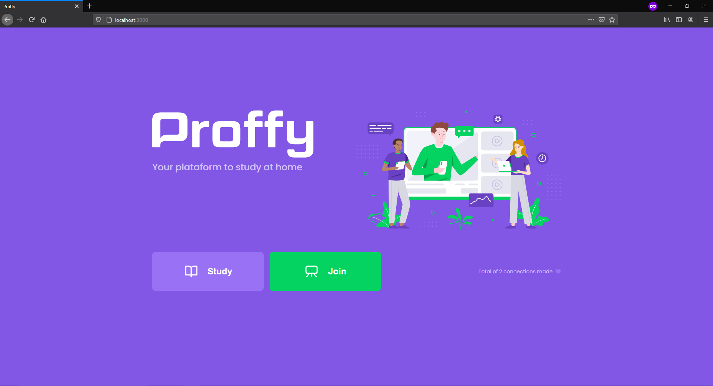
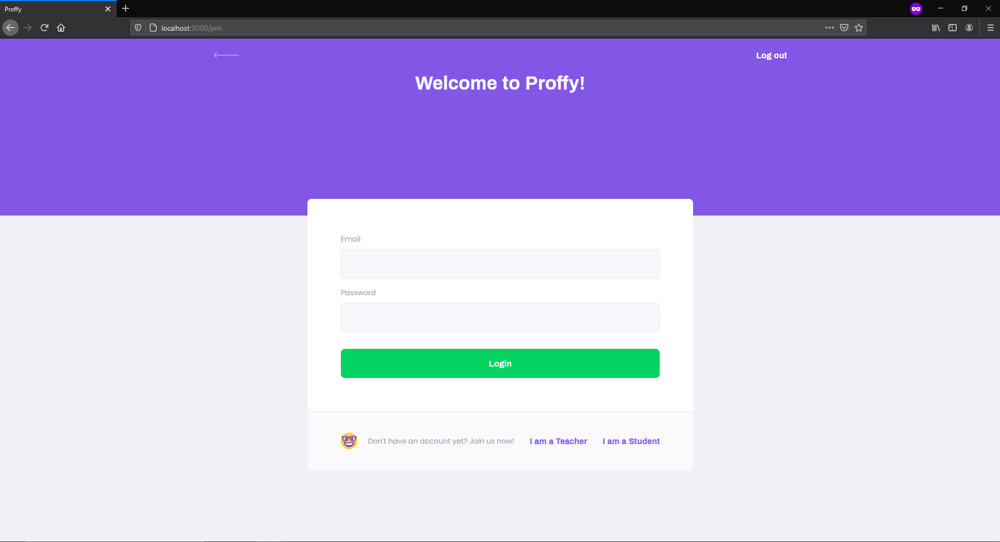
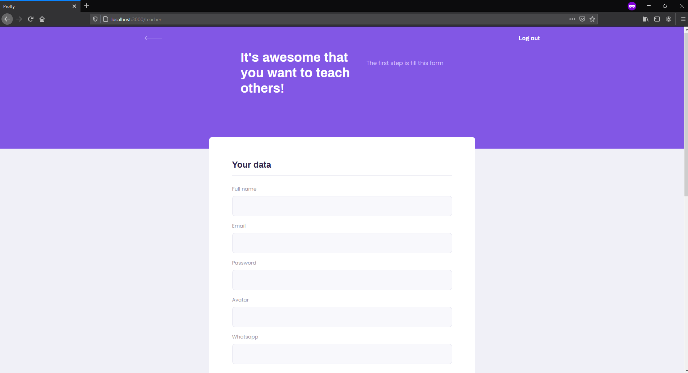
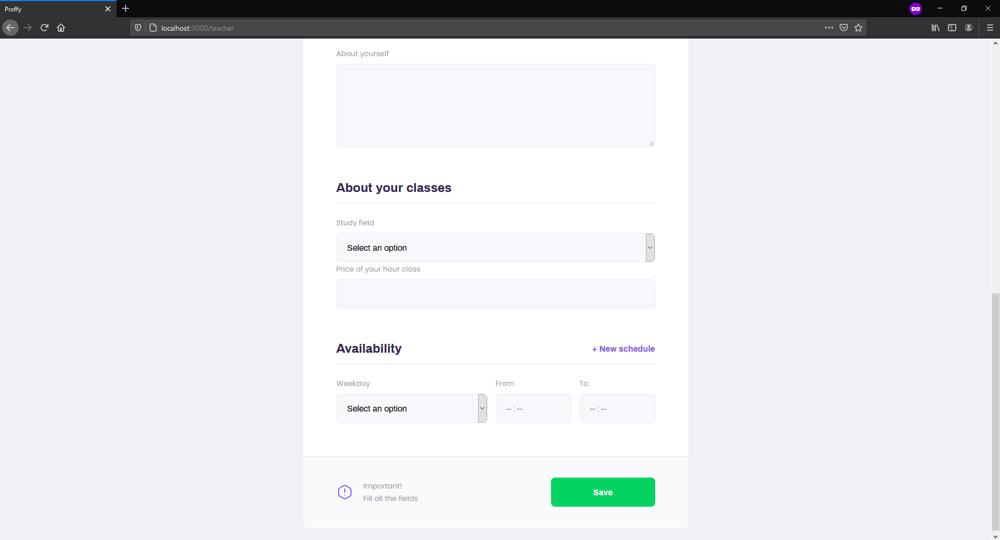
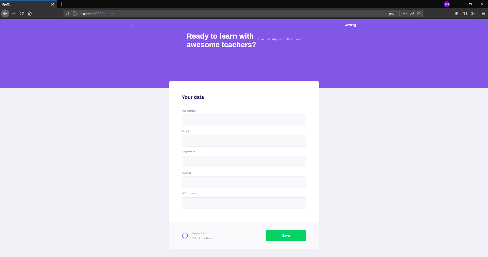
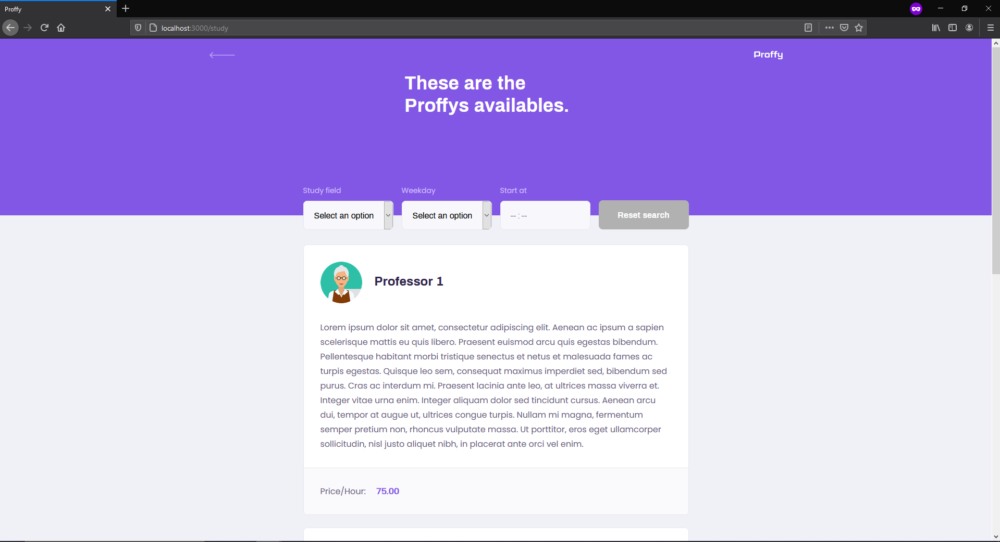
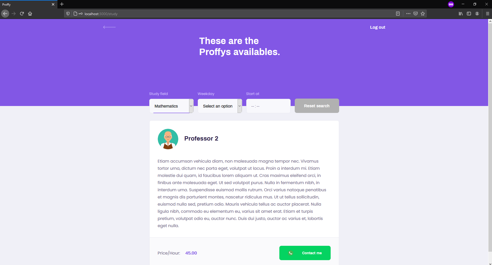

# Next Level Week : Proffy
A web app with a list of teachers with from many different study fields, where a student can register and call them via Whatsapp.

## About the course

This was one-week free course to programmers with mid or high experience with Javascript and SQL. The focus of the course was to delivery an application capable of simple register operations to highlight the advantages of Typescript, using React, React Native and Expo.

## Screenshots
       

# Challenging myself
For this Next Level Week, I used this project as a goal to deliver a web application using Apollo Client and Apollo Server, focusing on the backend of this application. I used MongoDB instead SQLite and used GraphQL instead of REST API. In the end, I also created *yaml* files to deploy the backend using Kubernetes locally.

## Database
Setting up the MongoDB compared to SQLite it was very straight forward. The main differences were the query to find intervals for the teacher' schedules: the logic was the same, but I had no previous experience with MongoDB operators. I was glad that it didn't take me long to figure out how to use.

## GraphQL vs REST API
As a final exercise, the instructor suggests for the teacher list to also display their available hours. 

* Using REST API, I would have to alter my teacher route to, instead get their name and bio, also get their schedules. So, if I was working as a frontend developer, I would have to wait until this backend route was ready to use.
* Using GraphQL, I have just to add in my query to also fetch the schedules. No need to wait anyone.

Besides this point, my main point when working in the backend was to be able to deliver querys and mutations that can be used safely for the client, but not worrying too much about the data itself.

## Authentication
This was not covered in the course, but I added an authentication storing a token in cookies. This cookie it's supposed to be safe and not easily modified, having the current logged user data. This data can differentiate a teacher from a student, since only students can contact teachers.
Besides these two, I also added an admin account that can retrieve sensitive data from GraphQL, like student’s data.

## Apollo Client
 This course started with the front, so I created a FakeApolloProdiver that mocked my backend for me be able to use querys to create the pages. It was quite easy to set up. After the backend was finish, the only thing that I had done different was to switch the FakeApolloProvider to a real ApolloProvider, doing 0 changes to the querys.

## Tests
I started to write some integrations tests for the backend. It was not that easy to setup, especially the context for the Apollo Server, but after it was done, it was easy forward to use. No big surprises after that.

## Kubernetes
This is also not covered in this course, but I added an option to the backend to be deployed to a cloud service. This part took most of my time, and it was only 4 files! But instead to use the Docker Desktop tool to generate a Kubernetes *yaml* file, I write by my own. Even thou the mongo image cannot persist data, I still think this was a huge accomplish.

# Final thoughts
In the end, I just used this project as an excuse to put in practice GraphQL and Kubernetes knowledge that I studied recently. There are improvements to be done in the frontend, some pages to do a makeover, some CSS to fix, but I was more worried about this new tech called GraphQL, that I had experience only using Gatsby before. I tried to use in this project a lot of GraphQL commands, like query, mutations, interface, directives, enums, but I couldn't use subscription. I still how to figure out a nice use case for it. Besides that, the way that I refactored the code is still bugging me. However, I have no idea how I can improve and make it easier for maintenance right now.

For the Kubernetes part, there is still a missing piece to learn: how to configure it for development environment and how to persist data. But for now, it is a huge step for me just to understand simple commands.

